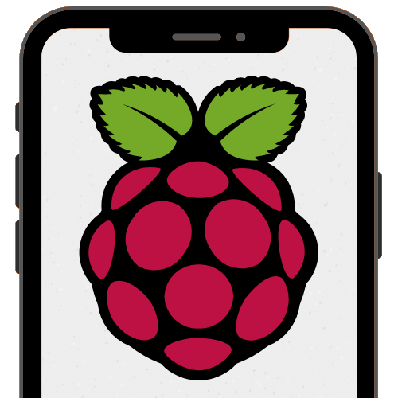

<p align="center">
  
  <h2 align="center">Raspberry Pocket - App</h2>
</p>

---

### Setup

```bash
# Cloning repo and installing dependencies

git clone https://github.com/gabrielrufino/RaspberryPocketApp/
cd RaspberryPocketApp
npm install

# Setup environment variables (Check and edit if necessary)
cp .env.example .env

# Run debug version for android
npm run android

# Run debug version for iOS
npm run ios
```


